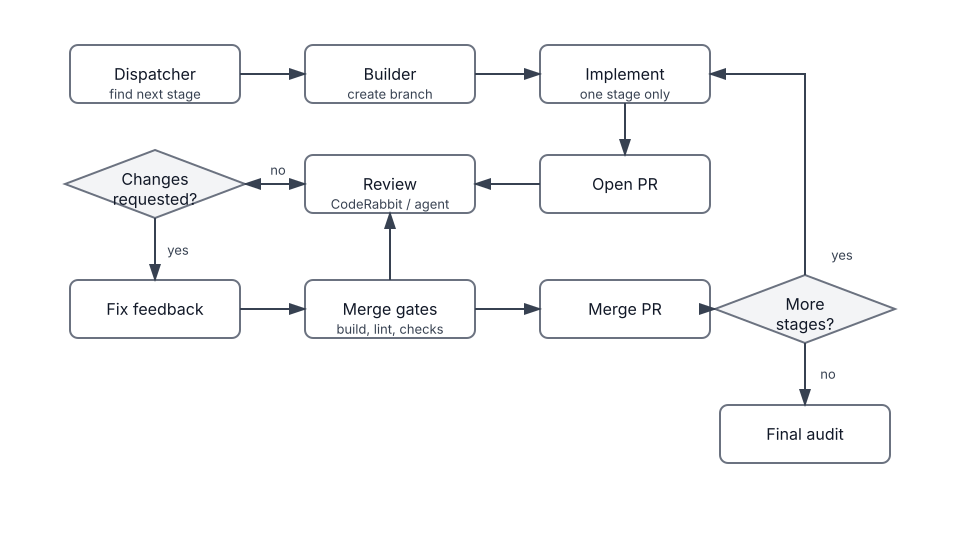
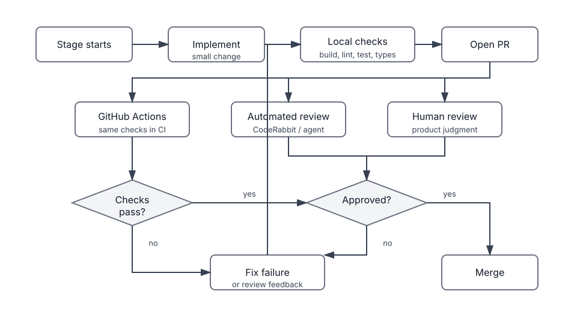

# Building Tab-Zen With a Goal-Oriented Coding Agent

I wanted to see what happens when an AI coding assistant is treated less like
autocomplete and more like a goal-oriented engineering agent.

The project was Tab-Zen, a local-first Chrome MV3 extension for calmer tab
management. The extension helps users see tab pressure, detect duplicate tabs,
clean up clutter, and receive lightweight interventions when browsing gets too
crowded.

The interesting part was not only the extension. It was the process.

Instead of asking for one feature at a time, I gave Codex a workflow file, a task
file, GitHub access, and a long-running goal. The agent then worked through the
project as a sequence of small pull requests.

## The Goal Prompt

The core prompt was:

```text
/goal Execute AGENT_WORKFLOW.md until all tasks in AGENT_TASKS.md are completed.

Process:

1. Execute Stage 0 first.
2. Work through stages sequentially.
3. Create one PR per stage.
4. Wait for review.
5. Fix CodeRabbit and reviewer comments.
6. Merge only after all merge gates pass.
7. Continue automatically to the next stage.
8. Stop only when all stages are complete or blocked.

Rules:

* Never commit .env.
* Never print secrets.
* Never skip reviews.
* Never combine stages.
* Keep PRs small.
* Maintain MV3 compatibility.
* Keep the project privacy-friendly and telemetry-free.
```

That prompt mattered because it turned the task from "build me an extension"
into an operating model. The agent had explicit constraints, merge gates, and
stop conditions.

## The Workflow

The repo contained two control files:

- `AGENT_WORKFLOW.md` described the engineering process.
- `AGENT_TASKS.md` described the staged product work.

The intended loop looked like this:



The merge gates were intentionally strict:

- build passes
- lint passes
- typecheck passes
- CI passes
- review comments are resolved
- reviewer approval exists
- branch is up to date
- no unresolved review requests remain

The stages were small:

<table>
  <colgroup>
    <col width="96">
    <col>
  </colgroup>
  <thead>
    <tr>
      <th>Stage</th>
      <th>Result</th>
    </tr>
  </thead>
  <tbody>
    <tr>
      <td>0</td>
      <td>Verified GitHub automation, auth, branches, PRs, issues, and labels</td>
    </tr>
    <tr>
      <td>1</td>
      <td>Created the MV3 Vite and TypeScript extension scaffold</td>
    </tr>
    <tr>
      <td>2</td>
      <td>Added the tab counter badge</td>
    </tr>
    <tr>
      <td>3</td>
      <td>Added the popup dashboard</td>
    </tr>
    <tr>
      <td>4</td>
      <td>Added memory awareness</td>
    </tr>
    <tr>
      <td>5</td>
      <td>Added Zen intervention logic</td>
    </tr>
    <tr>
      <td>6</td>
      <td>Added duplicate-tab cleanup tools</td>
    </tr>
    <tr>
      <td>7</td>
      <td>Added settings and validation</td>
    </tr>
    <tr>
      <td>8</td>
      <td>Prepared the repo for open source release</td>
    </tr>
    <tr>
      <td>Follow-up</td>
      <td>Added tests and GitHub PR checks</td>
    </tr>
  </tbody>
</table>

## What Actually Happened

The workflow mostly held up.

Codex created one PR per stage, worked through review feedback, merged only
after checks passed, and continued to the next stage. The final repository had a
working extension, documentation, privacy statement, contribution guide,
screenshots, tests, and a GitHub Actions workflow.

The review loop caught real issues. For example:

- the intervention page URL matching needed to avoid duplicate intervention tabs
- duplicate cleanup needed to re-query tabs before removal to avoid stale state
- test and CI coverage should have existed earlier in the process

Those are not cosmetic comments. They are the kind of problems that happen in
real browser-extension code.

## Usage

The main staged build used:

```text
1,162,619 tokens
about 72m 48s
```

The follow-up goal for tests and GitHub Actions used:

```text
55,445 tokens
about 6m 52s
```

Total:

```text
1,218,064 tokens
about 1h 19m 40s
```

This is the part that changed how I think about usage. The cost was not a single
large prompt. It came from sustained context: reading the repo, keeping the
workflow in memory, opening PRs, watching checks, responding to review, fixing
edge cases, and auditing the final state.

## Limits

I hit the ChatGPT Plus Codex limit after about an hour and had to wait for the
five-hour window to reset.

That was the clearest reminder that agentic coding is not the same usage pattern
as normal chat. The agent was not just answering questions. It was operating a
development loop.

OpenAI's Codex usage limits for Plus are described as rolling five-hour local
message ranges that vary by model and task complexity. The exact number of
messages is not the full story because large tasks consume more context and more
work per message.

In practice, long autonomous sessions can burn through the available Plus usage
quickly, especially when the agent is managing GitHub state and review loops.

## What Broke The Flow

The first break was the ChatGPT Plus limit. After roughly an hour, the work had
to stop until the five-hour window reset.

The second break was CodeRabbit. I used the free version, and I hit the review
limit. After that, I had Codex use another reviewer agent as a fallback.

That fallback worked. It caught useful issues. But it made the process more
expensive in tokens and more cluttered:

- another agent had to read the PR context
- feedback had to be copied back into the main loop
- more conversation state had to be preserved
- the review process became less clean than a single PR review thread

The result was still useful, but the workflow became heavier.

## What I Would Change Next Time

I would add CI before starting the staged PR workflow, not at the end.

In this run, the project gained tests and GitHub Actions after the full staged
build had already completed. That worked, but it means earlier stages relied on
manual local verification and review comments. A better version would make CI
part of the loop from Stage 1 onward.

The improved loop would look like this:



I would also add a human reviewer earlier. Automated review is good at finding
edge cases, missed checks, stale state, and suspicious code paths. A human is
still better for product judgment:

- Does the feature feel right?
- Is the UX too noisy?
- Is the architecture still simple?
- Is this worth shipping?

The best workflow is not agent-only. It is agent-first with human checkpoints.

## Main Insight

The most important insight was that autonomous coding works best when the rails
already exist.

The agent performed better when the repo told it how to work:

- one stage at a time
- one branch per stage
- one PR per stage
- strict merge gates
- review before merge
- no secrets
- local-first and telemetry-free constraints

Without that structure, the same task would probably have become a large,
messy implementation. With the structure, it became a sequence of reviewable
changes.

The next improvement is to move more quality gates earlier:

- CI from the beginning
- tests from the beginning
- human review from the beginning
- clearer token and elapsed-time tracking from the beginning

That would reduce token usage, make the review flow cleaner, and make the final
state easier to trust.

## Final Takeaway

Codex was most useful when treated like a coding agent inside a real engineering
process, not like a code generator.

It could read the repo, create branches, make commits, open PRs, respond to
review, watch checks, merge, and continue. But the quality came from the process
around it: small stages, explicit gates, review, tests, and final audits.

The practical lesson is simple:

If you want better results from an agentic coding workflow, do not only write a
better prompt. Write a better process.
